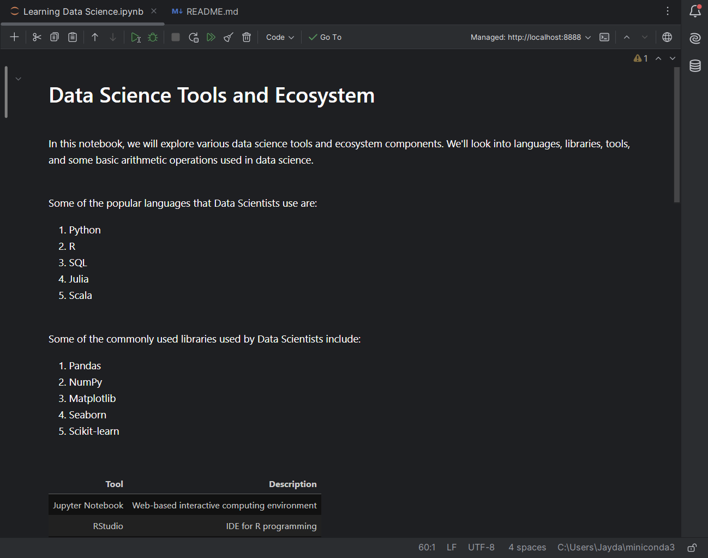

# 🚀 Learning Data Science

This repository contains my final assignment for the **"Tools for Data Science"** course.  
The notebook was created as part of my ongoing journey to learn and grow in the field of **Data Science**.

## 📚 Overview

The notebook, titled **"Data Science Tools and Ecosystem"**, introduces:
- Popular programming languages used in Data Science
- Commonly used libraries and tools
- A table of Data Science tools
- Basic Python arithmetic operations

This project is developed using **Jupyter Notebook**, with a combination of Markdown and Code cells.

## ✅ Exercises Covered

| Exercise | Description |
|----------|-------------|
| 2 | Title cell |
| 3 | Introduction cell |
| 4 | List of Data Science languages |
| 5 | List of Data Science libraries |
| 6 | Table of Data Science tools |
| 7 | Arithmetic expression in Markdown |
| 8 | Python code: Multiply and Add |
| 9 | Python code: Convert minutes to hours |
| 10 | Objectives list |
| 11 | Author name |
| 12 | Shared via GitHub |
| 13 | Screenshot included |

## 🔍 Preview the Notebook

Click here to view the notebook directly on GitHub:  
👉 [View Notebook on GitHub](https://github.com/Heavenly-Demon-0835/Learning-Data-Science)

## 🖼 Screenshot

A screenshot of the first page of the notebook is included as:  
📸 

## 👨‍💻 Author

**JAY DAVE**  
Aspiring Data Scientist | Lifelong Learner

---

*Thank you for checking out my work!*
